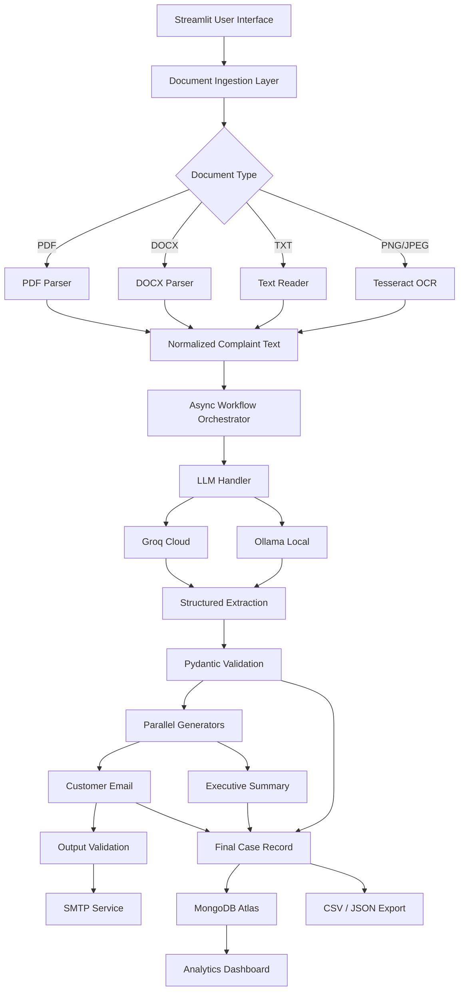

# 🚀 Resolvix AI

Resolvix AI is an intelligent document-processing platform that automates the handling of customer complaints and support cases. The system converts unstructured documents into structured business data, generates customer response emails, creates executive summaries, and stores processed records for analytics and reporting.
An autonomous, multi-modal GenAI document intelligence workflow engineered to transform unstructured customer complaints into structured operational data, automated customer response dispatches, and executive summaries.

[](https://www.python.org/)
[](https://groq.com/)
[](https://ollama.ai/)
[-0467DF?style=for-the-badge\&logo=meta\&logoColor=white)](https://ai.meta.com/llama/)
[](https://docs.pydantic.dev/)
[](https://streamlit.io/)
[](https://www.mongodb.com/cloud/atlas)
[](LICENSE)


## 📚 Table of Contents

### 🎯 1. Project Introduction

* [🎯 Project Overview](#-project-overview)
* [✨ Key Highlights](#-key-highlights)
* [🌐 Live Demo & Resources](#-live-demo--resources)
* [🎥 Demo Preview](#-demo-preview)

### 💡 2. Problem & Solution

* [❗ Problem Statement](#-problem-statement)
* [🎯 Objectives](#-objectives)
* [💡 Proposed Solution](#-proposed-solution)

### 🏗️ 3. System Design & Architecture

* [🏗️ System Architecture](#️-system-architecture)
* [🔄 End-to-End Workflow](#-end-to-end-workflow)
* [🧠 AI & LLM Architecture](#-ai--llm-architecture)
* [📄 Document Intelligence Pipeline](#-document-intelligence-pipeline)
* [🛡️ Validation & Reliability](#️-validation--reliability)
* [⚡ Async Processing & Concurrency](#-async-processing--concurrency)
* [📧 Automated Customer Communication](#-automated-customer-communication)
* [🗄️ Database Architecture](#️-database-architecture)
* [📊 Analytics & Reporting](#-analytics--reporting)

### 🧩 4. Features & Technology

* [✨ Key Features](#-key-features)
* [🛠️ Technology Stack](#️-technology-stack)
* [📂 Project Structure](#-project-structure)
* [📋 Data Model & Schema](#-data-model--schema)

### ⚙️ 5. Setup & Usage

* [🔐 Configuration](#-configuration)
* [⚙️ Installation](#️-installation)
* [🚀 Running the Application](#-running-the-application)
* [💡 Usage Guide](#-usage-guide)

### 🧪 6. Testing & Evaluation

* [🧪 Testing & Validation](#-testing--validation)
* [📈 Performance & Evaluation](#-performance--evaluation)
* [📝 Sample Input & Output](#-sample-input--output)

### 🔒 7. Engineering, Security & Roadmap

* [🛠️ Engineering Challenges & Solutions](#️-engineering-challenges--solutions)
* [🔒 Security Considerations](#-security-considerations)
* [⚠️ Limitations](#️-limitations)
* [🔮 Future Enhancements](#-future-enhancements)

### 🎓 8. Academic & Project Information

* [🎓 Assessment Requirements Mapping](#-assessment-requirements-mapping)
* [🧠 Key Learnings](#-key-learnings)
* [👩‍💻 Author](#-author)
* [🙏 Acknowledgements](#-acknowledgements)
* [📄 License](#-license)

### 🎯 1. Project Introduction

# 🎯 Project Overview

Modern customer-support organizations receive large volumes of complaints through multiple document formats, including PDF reports, Word documents, plain-text messages, and scanned images.

Important information such as customer identity, incident dates, complaint categories, urgency, sentiment, financial impact, and requested actions is often buried inside unstructured text.

Traditional manual workflows require support personnel to:

1. Open and read each document.
2. Identify customer information.
3. Extract complaint details.
4. Classify the complaint.
5. Determine urgency and sentiment.
6. Prepare a customer response.
7. Create an internal management summary.
8. Store the case in a database.
9. Send the response through email.
10. Generate reports for management.

This process is time-consuming, inconsistent, and difficult to scale.

**Resolvix AI automates this complete workflow.**

The system accepts heterogeneous complaint documents, extracts their contents, processes the information through an LLM pipeline, validates the generated structured data using Pydantic, generates customer and management outputs, persists the complete case record, and provides analytics through a web dashboard.

---

# ✨ Key Highlights

| Capability                 | Implementation                                  |
| -------------------------- | ----------------------------------------------- |
| 📄 Multi-Format Documents  | PDF, DOCX, TXT, PNG, JPEG                       |
| 🔍 OCR                     | Tesseract + Pillow                              |
| 🧠 Generative AI           | Groq Cloud + Ollama                             |
| 🤖 LLM Processing          | Structured extraction and contextual generation |
| 🛡️ Validation             | Pydantic v2                                     |
| ⚡ Async Processing         | Python `asyncio`                                |
| 🚦 Concurrency Control     | `asyncio.Semaphore`                             |
| 📧 Automated Communication | SMTP                                            |
| 🗄️ Persistence            | MongoDB Atlas                                   |
| 📊 Dashboard               | Streamlit                                       |
| 📤 Reporting               | CSV / JSON                                      |
| 🔄 Hybrid Inference        | Cloud + Local LLM                               |
| 🧩 Modular Architecture    | Independent Python service modules              |

---

# 🌐 Live Demo & Resources

### 🚀 Live Application

**Resolvix AI Streamlit Dashboard**

https://resolvix-ai.streamlit.app

### 🐙 Source Code

**GitHub Repository**

https://github.com/Radhika45/Resolvix_AI

### 📖 Project Documentation

The repository contains:

* Application source code
* Configuration templates
* Data-processing modules
* LLM integration
* Database integration
* Output-generation modules
* Streamlit interface
* Sample processing outputs
* Project documentation

### 🎥 Demonstration

A complete demonstration should cover:

* Document upload
* Format detection
* OCR/text extraction
* LLM processing
* Structured schema generation
* Customer response generation
* Executive summary generation
* Database persistence
* Email delivery status
* Analytics dashboard
* Export functionality

---

# 🎥 Demo Preview

> Replace the placeholder below with your actual project demonstration GIF, screenshot, or video thumbnail.

```text
┌─────────────────────────────────────────────────────────────┐
│                    RESOLVIX AI DASHBOARD                    │
├─────────────────────────────────────────────────────────────┤
│                                                             │
│  📁 Upload Complaint Documents                              │
│                                                             │
│  ┌───────────────────────────────────────────────────────┐  │
│  │  Complaint_Order_4091.pdf                             │  │
│  │  Complaint_Service_1022.docx                          │  │
│  │  Complaint_Delivery_781.png                           │  │
│  └───────────────────────────────────────────────────────┘  │
│                                                             │
│  AI Engine:  ● Groq Cloud   ○ Ollama Local                │
│                                                             │
│                 [ Start AI Processing ]                      │
│                                                             │
├─────────────────────────────────────────────────────────────┤
│  Extracted Data     Customer Response     Executive Summary │
└─────────────────────────────────────────────────────────────┘
```

---
### 💡 2. Problem & Solution

# ❗ Problem Statement

Customer-support organizations frequently receive complaints in unstructured and heterogeneous formats.

### Existing Challenges

**1. Unstructured Information**

Important operational information is embedded inside free-form narratives.

**2. Manual Processing**

Agents must manually read, classify, summarize, and record each complaint.

**3. Inconsistent Classification**

Different agents may assign different categories, urgency levels, or interpretations to similar complaints.

**4. Delayed Customer Communication**

Response generation and escalation can introduce unnecessary delays.

**5. Poor Scalability**

Manual workflows become increasingly inefficient as complaint volumes increase.

**6. API Reliability Challenges**

Large-scale AI processing can encounter downstream rate limits and transient failures.

**7. Data Integrity**

LLM-generated information must be validated before being stored or used operationally.

### Problem Definition

> How can Generative AI, document intelligence, structured validation, asynchronous processing, and automated communication be integrated into a reliable end-to-end complaint-processing system?

---

# 🎯 Objectives

The primary objectives of Resolvix AI are:

1. Build a multi-format complaint ingestion system.
2. Extract text from conventional and image-based documents.
3. Use Generative AI to convert unstructured text into structured information.
4. Enforce structured output using Pydantic validation.
5. Classify complaint category, urgency, and sentiment.
6. Generate context-aware customer responses.
7. Generate concise executive management summaries.
8. Automate customer communication through SMTP.
9. Persist processed cases in MongoDB Atlas.
10. Provide analytics and reporting through Streamlit.
11. Support asynchronous batch processing.
12. Control concurrency to reduce API rate-limit failures.
13. Provide cloud and local LLM execution options.
14. Maintain a modular and extensible software architecture.

---

# 💡 Proposed Solution

Resolvix AI implements an automated document-intelligence pipeline.

```text
                   CUSTOMER COMPLAINT
                           │
                           ▼
                 ┌───────────────────┐
                 │ Document Ingestion │
                 └─────────┬─────────┘
                           │
              ┌────────────┴────────────┐
              ▼                         ▼
       Text Documents              Image Documents
       PDF / DOCX / TXT            PNG / JPEG
              │                         │
              │                    Tesseract OCR
              │                         │
              └────────────┬────────────┘
                           ▼
                    Extracted Text
                           │
                           ▼
                 LLM Processing Layer
                 ┌─────────┴─────────┐
                 │                   │
              Groq Cloud          Ollama
                 │                   │
                 └─────────┬─────────┘
                           ▼
                  Structured Extraction
                           │
                           ▼
                   Pydantic Validation
                           │
                           ▼
              ┌────────────┴────────────┐
              ▼                         ▼
       Customer Response        Executive Summary
              │                         │
              └────────────┬────────────┘
                           ▼
                  Final Case Record
                    ┌──────┴──────┐
                    ▼             ▼
                MongoDB          SMTP
                    │             │
                    ▼             ▼
                Analytics     Customer Inbox
```

---
### 🏗️ 3. System Design & Architecture

# 🏗️ System Architecture

Resolvix AI follows a modular layered architecture.



---

# 🔄 End-to-End Workflow

## Phase 1 — Document Intake

The user uploads one or more complaint documents through the Streamlit interface.

Supported formats:

```text
.pdf
.docx
.txt
.png
.jpeg
```

The ingestion module identifies the document type and routes it to the appropriate parser.

---

## Phase 2 — Text Extraction

### PDF

PDF documents are processed using a native PDF parser.

### DOCX

Word documents are processed using `python-docx`.

### TXT

Plain-text files are loaded directly.

### Images

Image complaints are processed using:

```text
Pillow
   ↓
Tesseract OCR
   ↓
Extracted Text
```

The result is a normalized text representation.

---

## Phase 3 — Structured AI Extraction

The normalized complaint text is supplied to the selected LLM.

The model identifies:

* Customer name
* Email
* Phone
* Incident date
* Complaint category
* Urgency
* Sentiment
* Complaint summary

The result is converted into the application's structured data model.

---

## Phase 4 — Validation

The generated information is validated against the Pydantic schema.

Invalid or malformed outputs are rejected or handled according to the workflow's error-handling logic.

---

## Phase 5 — Parallel Content Generation

After validation, two independent generation tasks are executed:

```text
                 Validated Complaint
                         │
              ┌──────────┴──────────┐
              ▼                     ▼
     Customer Response       Executive Summary
              │                     │
              └──────────┬──────────┘
                         ▼
                   Final Case Record
```

---

## Phase 6 — Communication

If the generated customer response passes validation and a valid recipient email exists, the system can dispatch the response through SMTP.

---

## Phase 7 — Persistence

The complete case record is stored in MongoDB Atlas.

---

## Phase 8 — Analytics

Historical records can be retrieved for:

* Case monitoring
* Urgency analysis
* Complaint-category analysis
* Sentiment analysis
* Reporting
* CSV/JSON export

---

# 🧠 AI & LLM Architecture

Resolvix AI uses a hybrid LLM architecture.

```text
                 LLM Abstraction Layer
                         │
             ┌───────────┴───────────┐
             │                       │
             ▼                       ▼
       Groq Cloud                Ollama Local
       Remote LLM                Local LLM
             │                       │
             └───────────┬───────────┘
                         ▼
                 Common AI Workflow
```

## Groq Cloud

Groq provides high-speed cloud inference suitable for production-style processing and rapid experimentation.

## Ollama

Ollama provides a local execution path for scenarios where local inference, offline processing, or reduced cloud dependency is desirable.

## Provider Abstraction

The application isolates provider-specific logic inside the LLM handling layer so that the rest of the workflow can operate using a common interface.

This design makes future model replacement easier.

---

# 📄 Document Intelligence Pipeline

Resolvix AI treats document processing as a unified intelligence pipeline rather than simply reading files.

```text
Raw Document
     │
     ▼
Format Detection
     │
     ▼
Text / OCR Extraction
     │
     ▼
Text Normalization
     │
     ▼
LLM Interpretation
     │
     ▼
Structured Metadata
```

### Supported Input Matrix

| Format | Processing Method    | Output |
| ------ | -------------------- | ------ |
| PDF    | PDF parser           | Text   |
| DOCX   | `python-docx`        | Text   |
| TXT    | Native Python reader | Text   |
| PNG    | Tesseract OCR        | Text   |
| JPEG   | Tesseract OCR        | Text   |

---

# 🛡️ Validation & Reliability

LLMs generate probabilistic outputs. Enterprise workflows therefore require deterministic validation around AI components.

Resolvix AI uses **Pydantic v2** as a structural validation layer.

### Validation Responsibilities

* Required fields
* Data types
* Enumerated values
* Default values
* Email validation
* Date formatting
* Summary constraints
* Output structure

### Example

```python
ComplaintDetails(
    customer_name="Sarah Connor",
    email="sarah.c@sky.net",
    phone="N/A",
    incident_date="2026-09-02",
    complaint_category="Billing",
    urgency_level="High",
    sentiment="Frustrated",
    summary="Duplicate subscription charge requiring refund."
)
```

The validation layer reduces the risk of malformed AI output reaching downstream systems.

---

# ⚡ Async Processing & Concurrency

Batch processing multiple complaints simultaneously can create excessive downstream API traffic.

Resolvix AI uses Python's asynchronous execution model.

```text
Complaint A ──┐
Complaint B ──┤
Complaint C ──┼──► Async Workflow
Complaint D ──┤
Complaint E ──┘
```

Concurrency is controlled using:

```python
asyncio.Semaphore(2)
```

This provides controlled parallelism while reducing the likelihood of API rate-limit errors such as HTTP `429`.

### Parallel Generation

Independent outputs can also be generated concurrently:

```python
await asyncio.gather(
    generate_customer_email(),
    generate_management_summary()
)
```

This reduces unnecessary sequential waiting.

---

# 📧 Automated Customer Communication

Resolvix AI can generate professional customer-facing responses based on the extracted complaint information.

The generated response considers:

* Customer name
* Complaint details
* Complaint category
* Urgency
* Sentiment
* Required action

Before dispatch, the workflow performs validation checks.

```text
LLM Generated Email
        │
        ▼
Output Validation
        │
   ┌────┴────┐
   │         │
 Valid      Invalid
   │         │
   ▼         ▼
 SMTP      Suppress
 Dispatch   Send
```

SMTP communication is configured through environment variables rather than hard-coded credentials.

---

# 🗄️ Database Architecture

MongoDB Atlas is used for persistent case storage.

### Logical Data Flow

```text
Processed Complaint
       │
       ▼
Final Case Object
       │
       ▼
MongoDB Atlas
       │
       ├── Raw Complaint Text
       ├── Extracted Metadata
       ├── Generated Customer Email
       ├── Executive Summary
       ├── Processing Timestamp
       └── Email Delivery Status
```

### Database

```text
complaint_management_db
```

### Collection

```text
complaints
```

> The exact collection name should be kept synchronized with the implementation in `src/db.py`.

---

# 📊 Analytics & Reporting

The Streamlit dashboard provides an operational view of historical complaint records.

Potential dashboard metrics include:

* Total complaints
* High-priority cases
* Critical cases
* Complaint categories
* Sentiment distribution
* Processing history
* Email delivery status

### Export Formats

```text
CSV
JSON
```

This allows processed data to be used by external reporting or business-intelligence workflows.

---
### 🧩 4. Features & Technology
# ✨ Key Features

| Feature                   | Description                                                             |
| ------------------------- | ----------------------------------------------------------------------- |
| 📄 Multi-Format Ingestion | Processes PDF, DOCX, TXT and image documents                            |
| 🔍 OCR                    | Extracts text from scanned complaint images                             |
| 🧠 Generative AI          | Converts unstructured complaints into operational information           |
| 🔀 Hybrid LLM             | Supports cloud and local inference                                      |
| 🛡️ Structured Validation | Pydantic-based output validation                                        |
| ⚡ Async Execution         | Supports controlled parallel processing                                 |
| 🚦 Rate-Limit Protection  | Semaphore-based concurrency control                                     |
| 📧 Automated Responses    | Generates and optionally dispatches customer emails                     |
| 📋 Executive Summaries    | Produces management-oriented case summaries                             |
| 🗄️ Persistent Storage    | MongoDB Atlas case management                                           |
| 📊 Analytics              | Streamlit-based reporting                                               |
| 📤 Export                 | CSV and JSON historical data                                            |
| 🧩 Modular Design         | Separates ingestion, AI, workflow, database, and communication concerns |

---

# 🛠️ Technology Stack

| Layer            | Technology    | Purpose                     |
| ---------------- | ------------- | --------------------------- |
| Frontend         | Streamlit     | Interactive web application |
| Language         | Python 3.10+  | Core implementation         |
| LLM              | Groq          | Cloud inference             |
| Local LLM        | Ollama        | Local inference             |
| Model            | Llama 3.2     | Local language model        |
| AI Framework     | LangChain     | LLM orchestration           |
| Validation       | Pydantic v2   | Structured data validation  |
| OCR              | Tesseract     | Image-to-text conversion    |
| Image Processing | Pillow        | Image handling              |
| PDF Processing   | PyPDF         | PDF text extraction         |
| Word Processing  | python-docx   | DOCX extraction             |
| Async Processing | asyncio       | Concurrent execution        |
| Database         | MongoDB Atlas | Persistent case storage     |
| Database Driver  | PyMongo       | MongoDB communication       |
| Email            | smtplib       | SMTP communication          |
| Data Export      | CSV / JSON    | Reporting and integration   |
| Configuration    | python-dotenv | Environment configuration   |

---

# 📂 Project Structure

```text
Resolvix_AI/
│
├── README.md
├── requirements.txt
├── .env
├── .gitignore
├── app.py
│
├── data/
│   └── uploaded_documents/
│
├── output/
│   ├── case_summaries/
│   ├── customer_emails/
│   ├── structured_data/
│   └── results.csv
│
└── src/
    ├── __init__.py
    ├── db.py
    ├── email_sender.py
    ├── exporter.py
    ├── extractor.py
    ├── generators.py
    ├── ingestion.py
    ├── llm_handler.py
    ├── logger.py
    ├── schema.py
    └── workflow.py
```

### Module Responsibilities

| Module            | Responsibility                            |
| ----------------- | ----------------------------------------- |
| `app.py`          | Streamlit application                     |
| `ingestion.py`    | Document routing and extraction           |
| `extractor.py`    | Structured complaint extraction           |
| `schema.py`       | Pydantic data models                      |
| `llm_handler.py`  | LLM provider management                   |
| `generators.py`   | Customer and management output generation |
| `workflow.py`     | End-to-end orchestration                  |
| `db.py`           | MongoDB persistence                       |
| `email_sender.py` | SMTP communication                        |
| `exporter.py`     | CSV/JSON export                           |
| `logger.py`       | Application logging                       |

---

# 📋 Data Model & Schema

The core complaint schema contains the following fields:

| Field                | Type   | Validation / Constraint        | Purpose                  |
| -------------------- | ------ | ------------------------------ | ------------------------ |
| `customer_name`      | String | Default value available        | Customer identity        |
| `email`              | String | Email validation               | Customer communication   |
| `phone`              | String | Default `N/A`                  | Contact number           |
| `incident_date`      | String | `YYYY-MM-DD` / `N/A`           | Incident date            |
| `complaint_category` | Enum   | Defined categories             | Complaint classification |
| `urgency_level`      | Enum   | Low / Medium / High / Critical | Priority                 |
| `sentiment`          | Enum   | Defined sentiment values       | Emotional classification |
| `summary`            | String | Maximum length constraint      | Complaint summary        |

### Example Structured Object

```json
{
  "customer_name": "Sarah Connor",
  "email": "sarah.c@sky.net",
  "phone": "N/A",
  "incident_date": "2026-09-02",
  "complaint_category": "Billing",
  "urgency_level": "High",
  "sentiment": "Frustrated",
  "summary": "Customer reported a duplicate subscription charge and requested an immediate refund."
}
```

---

### ⚙️ 5. Setup & Usage
# 🔐 Configuration

Resolvix AI uses environment variables for external services and sensitive configuration.

Create:

```text
.env
```

in the project root.

Example:

```ini
# LLM CONFIGURATION
GROQ_API_KEY="your_groq_api_key"
GROQ_MODEL="openai/gpt-oss-20b"
OLLAMA_MODEL="llama3.2"

# DATABASE
MONGO_URI="mongodb+srv://<username>:<password>@<cluster>/<database>"
DB_NAME="complaint_management_db"

# SMTP
SMTP_SERVER="smtp.gmail.com"
SMTP_PORT=587
SMTP_USERNAME="your_email@gmail.com"
SMTP_PASSWORD="your_app_password"
```

### Security Rule

**Never commit the `.env` file to GitHub.**

Ensure `.gitignore` contains:

```text
.env
venv/
__pycache__/
*.pyc
```

---

# ⚙️ Installation

## Prerequisites

Install the following:

* Python 3.10+
* Git
* Tesseract OCR
* Optional: Ollama
* MongoDB Atlas account
* Groq API access if using cloud inference
* SMTP-enabled email account if email dispatch is required

---

## 1. Clone Repository

```bash
git clone https://github.com/Radhika45/Resolvix_AI.git

cd Resolvix_AI
```

---

## 2. Create Virtual Environment

### Windows

```powershell
python -m venv venv

.\venv\Scripts\Activate.ps1
```

### Linux / macOS

```bash
python3 -m venv venv

source venv/bin/activate
```

---

## 3. Install Dependencies

```bash
python -m pip install --upgrade pip

pip install -r requirements.txt
```

---

## 4. Install Tesseract OCR

### Windows

Install Tesseract using a trusted Windows distribution and ensure its executable is available to the application.

### Ubuntu / Debian

```bash
sudo apt-get update

sudo apt-get install tesseract-ocr
```

### macOS

```bash
brew install tesseract
```

---

## 5. Optional: Install Ollama

If local inference is required, install Ollama and download the configured model.

```bash
ollama pull llama3.2
```

---

# 🚀 Running the Application

## Streamlit Dashboard

Run:

```bash
streamlit run app.py
```

The application will normally be available at:

```text
http://localhost:8501
```

---

## Headless Batch Processing

For command-line processing:

```bash
python -c "from src.workflow import ComplaintWorkflow; wf = ComplaintWorkflow(); print(wf.process_batch())"
```

---

# 💡 Usage Guide

## Step 1 — Launch Application

Start the Streamlit dashboard.

```bash
streamlit run app.py
```

---

## Step 2 — Upload Complaint Documents

Upload one or multiple supported files:

```text
PDF
DOCX
TXT
PNG
JPEG
```

---

## Step 3 — Select AI Provider

Choose between:

```text
Groq Cloud
Ollama Local
```

---

## Step 4 — Start Processing

Click:

```text
Start AI Processing
```

---

## Step 5 — Review Extracted Information

Inspect:

* Customer name
* Email
* Phone
* Incident date
* Complaint category
* Urgency
* Sentiment
* Summary

---

## Step 6 — Review Generated Outputs

The system produces:

### Customer Response

A professional customer-facing response.

### Executive Summary

A concise internal management summary.

---

## Step 7 — Check Email Status

If SMTP is configured, verify the delivery status of the generated response.

---

## Step 8 — Review Analytics

Use the analytics dashboard to inspect historical cases and export data.

---

### 🧪 6. Testing & Evaluation
# 🧪 Testing & Validation

Testing should verify both conventional software behavior and AI-pipeline reliability.

### Functional Testing

| Test Area          | Expected Result                          |
| ------------------ | ---------------------------------------- |
| TXT ingestion      | Text successfully extracted              |
| PDF ingestion      | PDF content extracted                    |
| DOCX ingestion     | Word content extracted                   |
| Image ingestion    | OCR text generated                       |
| Schema validation  | Invalid structures rejected              |
| Email validation   | Invalid addresses handled                |
| Database insertion | Case successfully persisted              |
| CSV export         | Records exported correctly               |
| JSON export        | Structured records exported              |
| LLM failure        | Workflow handles failure safely          |
| SMTP failure       | Delivery error does not crash processing |

### AI Pipeline Validation

The generated outputs should be checked for:

* Correct field names
* Correct data types
* Valid enumerated values
* Appropriate urgency
* Relevant summaries
* Consistent customer information
* Absence of malformed output

### Error Handling

The application should gracefully handle:

```text
Invalid documents
Missing fields
OCR failures
LLM failures
API rate limits
Network errors
Database failures
SMTP failures
Malformed model output
```

---

# 📈 Performance & Evaluation

Performance evaluation should consider more than raw execution speed.

### Evaluation Dimensions

| Metric                   | Purpose                                   |
| ------------------------ | ----------------------------------------- |
| Processing Time          | Measures end-to-end latency               |
| Extraction Accuracy      | Measures correctness of structured fields |
| Validation Success Rate  | Measures schema compliance                |
| OCR Quality              | Measures image-text extraction quality    |
| Email Generation Quality | Measures response relevance               |
| Summary Quality          | Measures management usefulness            |
| API Failure Rate         | Measures system reliability               |
| Database Success Rate    | Measures persistence reliability          |
| Batch Throughput         | Measures scalability                      |

### Concurrency Evaluation

The application uses controlled asynchronous processing to balance:

```text
Throughput
      +
API Stability
      +
Resource Utilization
```

The semaphore-based design prevents unrestricted parallel requests.

> **Important:** Performance numbers reported in the final academic report should be based on measurements from your actual test environment rather than hard-coded claims.

---

# 📝 Sample Input & Output

## Sample Input

**File:**

```text
Complaint_Order_4091.txt
```

```text
To Customer Support,

My name is Sarah Connor. My email address is sarah.c@sky.net.

On September 2nd, 2026, I noticed that my credit card was charged
$299 twice for the renewal of my enterprise software subscription
(Order #4091).

I am extremely frustrated by this billing error.

Please resolve this issue immediately and refund the duplicate
charge of $299.

Regards,
Sarah Connor
```

---

## Structured Extraction

```json
{
  "customer_name": "Sarah Connor",
  "email": "sarah.c@sky.net",
  "phone": "N/A",
  "incident_date": "2026-09-02",
  "complaint_category": "Billing",
  "urgency_level": "High",
  "sentiment": "Frustrated",
  "summary": "Customer reported a duplicate subscription charge and requested an immediate refund."
}
```

---

## Generated Customer Response

```text
Dear Sarah Connor,

Thank you for bringing this issue to our attention.

We sincerely apologize for the inconvenience caused by the duplicate
charge associated with Order #4091.

Your complaint has been identified as a high-priority billing issue
and has been escalated for review. The duplicate charge is being
investigated, and the appropriate refund process will be initiated
according to the applicable billing procedure.

Thank you for your patience while we work to resolve the issue.

Best regards,
Customer Experience Support Team
```

---

## Executive Summary

```text
EXECUTIVE CASE SUMMARY
--------------------------------------------

Customer: Sarah Connor
Category: Billing
Urgency: HIGH
Sentiment: Frustrated
Reference: Complaint_Order_4091.txt

INCIDENT:

Customer reported being charged twice for a subscription renewal
associated with Order #4091.

REQUIRED ACTION:

Review the duplicate transaction and initiate the applicable refund
process.
```

---

### 🔒 7. Engineering, Security & Roadmap
# 🛠️ Engineering Challenges & Solutions

## 1. API Rate Limiting

### Challenge

Parallel LLM requests can exceed provider rate limits.

### Solution

Controlled concurrency was implemented using:

```python
asyncio.Semaphore(2)
```

This allows asynchronous execution while limiting the number of simultaneous operations.

---

## 2. Malformed LLM Output

### Challenge

LLMs may return unexpected structures or values.

### Solution

Pydantic validation provides a deterministic schema boundary between AI generation and downstream processing.

---

## 3. Failed AI Requests

### Challenge

Network errors, provider failures, and timeouts can occur during inference.

### Solution

Provider handling and workflow-level error management isolate failures and prevent invalid results from automatically entering downstream operations.

---

## 4. Unsafe Email Dispatch

### Challenge

A failed generation request must never be treated as a valid customer response.

### Solution

Generated output is checked before SMTP dispatch.

```text
Generation
    ↓
Validation
    ↓
Success? ── No ──► Suppress Email
    │
   Yes
    ↓
SMTP Dispatch
```

---

## 5. Virtual Environment Path Issues

### Challenge

Moving or renaming the project directory can invalidate environment-specific executable paths.

### Solution

The virtual environment can be recreated cleanly from the dependency manifest.

---

# 🔒 Security Considerations

Security is particularly important because complaint documents may contain customer information.

### Credential Management

API keys, database credentials, and SMTP credentials are stored in environment variables.

### Repository Protection

Sensitive configuration must not be committed to version control.

### Database Security

MongoDB Atlas access should use:

* Authentication
* Restricted network access
* Least-privilege database users
* Strong credentials

### Email Security

SMTP communication should use TLS-enabled connections.

### Data Privacy

Production deployments should avoid unnecessarily exposing:

* Customer names
* Email addresses
* Phone numbers
* Financial information
* Raw complaint documents

### LLM Privacy

Organizations should evaluate provider-specific data-handling policies before processing sensitive production information.

---

# ⚠️ Limitations

Although Resolvix AI demonstrates an end-to-end AI automation architecture, several limitations remain.

### 1. OCR Accuracy

Poor-quality scans, unusual fonts, handwritten text, and distorted images may reduce extraction accuracy.

### 2. LLM Reliability

LLMs can still produce incorrect interpretations despite structured validation.

Pydantic validates **structure**, not factual correctness.

### 3. Semantic Classification

Complaint category, sentiment, and urgency depend on model interpretation and prompt quality.

### 4. SMTP Dependency

Automated communication depends on correctly configured SMTP infrastructure.

### 5. External API Dependency

Cloud inference depends on provider availability, network connectivity, quotas, and rate limits.

### 6. No Full Human Approval Layer

Critical customer communications may require human approval before production deployment.

### 7. Limited Domain Knowledge

The current system does not use a company-specific knowledge base or retrieval-augmented generation system.

---

# 🔮 Future Enhancements

## 1. Retrieval-Augmented Generation

Integrate a vector database such as ChromaDB to retrieve:

* Company policies
* Refund policies
* Service-level agreements
* Product documentation
* Escalation procedures

```text
Complaint
    ↓
Retriever
    ↓
Relevant Company Policy
    ↓
LLM
    ↓
Grounded Response
```

---

## 2. Agentic Workflow

Introduce LangGraph or a similar workflow engine for multi-step decision making.

Potential workflow:

```text
Complaint
   ↓
Extract
   ↓
Classify
   ↓
Retrieve Policy
   ↓
Assess Risk
   ↓
Human Approval?
   ├── Yes → Send
   └── No  → Escalate
```

---

## 3. Human-in-the-Loop Approval

Critical cases should require human authorization before customer communication.

---

## 4. Containerization

Package the application using Docker for reproducible deployment.

Potential future infrastructure:

```text
Docker
   ↓
Kubernetes
   ↓
Cloud Infrastructure
```

---

## 5. Enterprise Authentication

Introduce:

* User authentication
* Role-Based Access Control
* Agent roles
* Management roles
* Administrator roles

---

## 6. Observability

Introduce production-grade monitoring for:

* Latency
* Token usage
* LLM errors
* API failures
* Processing throughput
* Email failures
* Database failures

---

## 7. Automated Evaluation

Add an evaluation framework for:

* Extraction accuracy
* Classification accuracy
* Summary quality
* Response quality
* OCR quality
* Hallucination detection

---

### 🎓 8. Academic & Project Information
# 🎓 Assessment Requirements Mapping

The project requirements can be mapped directly to their technical implementations.

| Assessment Requirement | Technical Implementation                       | Status |
| ---------------------- | ---------------------------------------------- | ------ |
| Multi-Format Ingestion | PDF, DOCX, TXT and image processing            | ✅      |
| OCR                    | Tesseract + Pillow                             | ✅      |
| Generative AI          | Groq / Ollama LLM integration                  | ✅      |
| Structured Extraction  | Pydantic-based schema                          | ✅      |
| NLP Classification     | Category, urgency and sentiment generation     | ✅      |
| Automated Response     | Context-aware customer email generation        | ✅      |
| Executive Summary      | LLM-generated management summaries             | ✅      |
| Async Processing       | Python `asyncio`                               | ✅      |
| Concurrency Control    | `asyncio.Semaphore`                            | ✅      |
| Database Persistence   | MongoDB Atlas + PyMongo                        | ✅      |
| Email Automation       | SMTP / `smtplib`                               | ✅      |
| Web Application        | Streamlit                                      | ✅      |
| Reporting              | CSV / JSON export                              | ✅      |
| Analytics              | Streamlit dashboard                            | ✅      |
| Error Handling         | Workflow-level validation and failure handling | ✅      |
| Hybrid AI Architecture | Cloud + local LLM providers                    | ✅      |
| Modular Architecture   | Dedicated source modules                       | ✅      |

---

# 🧠 Key Learnings

## Structured AI Output

LLMs are powerful but probabilistic. Structured schemas provide an important reliability boundary around AI-generated information.

## AI + Traditional Software Engineering

A production-oriented AI application requires more than an LLM.

It requires:

```text
LLM
+
Validation
+
Error Handling
+
Concurrency
+
Persistence
+
Security
+
Observability
```

## Asynchronous Processing

Controlled concurrency improves batch-processing efficiency while reducing unnecessary API failures.

## Hybrid Architecture

Combining cloud and local inference provides greater flexibility and reduces dependence on a single inference provider.

## Modular Software Design

Separating ingestion, extraction, generation, persistence, communication, and orchestration makes the application easier to test, maintain, and extend.

## AI System Reliability

A key lesson from the project is that **AI output should never be trusted blindly when it controls downstream business operations**.

Validation and deterministic application logic should surround probabilistic model behavior.

---

# 👩‍💻 Author

### Radhika

**B.Tech — Computer Science & Engineering**
**PCTE Institute of Engineering & Technology**
**Class of 2026**

* GitHub: `@Radhika45`
* Project: `Resolvix AI`
* Live Application: `Resolvix AI`

---

# 🙏 Acknowledgements

Special thanks to the open-source and developer communities behind the technologies used in this project.

* **Streamlit** — Interactive application framework
* **Groq** — High-speed LLM inference
* **Ollama** — Local LLM execution
* **Meta AI** — Llama model family
* **LangChain** — LLM application orchestration
* **Pydantic** — Structured data validation
* **MongoDB Atlas** — Cloud database infrastructure
* **Tesseract OCR** — Optical character recognition
* **Python** — Core programming ecosystem

---

# 📄 License

This project is licensed under the **MIT License**.

See the [`LICENSE`](LICENSE) file for details.

---

# ⭐ Project Summary

**Resolvix AI** demonstrates the design and implementation of an end-to-end Generative AI document-intelligence system for automated customer complaint processing.

The system integrates:

```text
Multi-Format Document Processing
            ↓
OCR / Text Extraction
            ↓
Generative AI
            ↓
Structured Pydantic Validation
            ↓
Async Workflow Orchestration
            ↓
Customer Response Generation
            ↓
Executive Case Summarization
            ↓
Automated SMTP Communication
            ↓
MongoDB Persistence
            ↓
Analytics & Reporting
```

The project demonstrates how modern Generative AI can be combined with traditional software engineering principles to create a **structured, modular, reliable, and extensible enterprise-oriented automation system**.

> **Resolvix AI — Transforming Unstructured Complaints into Validated Operational Intelligence.**
