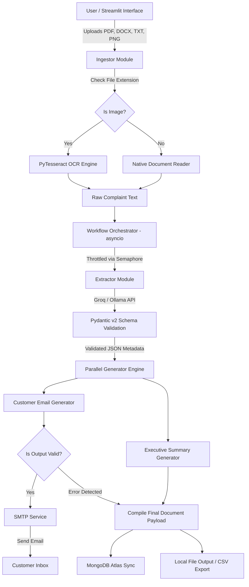

# 🚀 Resolvix AI

### Enterprise-Grade AI-Powered Customer Complaint & Case Processing System

An autonomous, multi-modal GenAI document intelligence workflow engineered to transform unstructured customer complaints into structured operational data, automated customer response dispatches, and executive summaries.

[](https://www.python.org/)
[](https://groq.com/)
[](https://ollama.ai/)
[-0467DF?style=for-the-badge\&logo=meta\&logoColor=white)](https://ai.meta.com/llama/)
[](https://docs.pydantic.dev/)
[](https://streamlit.io/)
[](https://www.mongodb.com/cloud/atlas)
[](LICENSE)

**[Live App Demo](https://resolvix-ai.streamlit.app)** • **[System Architecture](#-system-architecture)** • **[Installation Guide](#-installation-guide)** • **[Running Steps](#-running-the-application)** • **[Assessment Mapping](#-assessment-requirements-mapping)**

---

## 📌 Project Overview

**Resolvix AI** addresses a fundamental operational bottleneck in modern enterprise customer service ecosystems: manual document triaging and complaint handling.

High-volume support operations regularly ingest hundreds of unstructured complaint files in disparate formats such as `.pdf`, `.docx`, `.txt`, and scanned images. Processing these manually results in high resolution latency, inconsistent escalation tracking, missing customer metadata, and increasing operational costs.

### Why Traditional Approaches Fail

* **Brittle Regex Parsing:** Fails on dynamic, unformatted, or non-standardized document layouts and image scans.
* **Manual Data Entry:** Support agents may spend 12–18 minutes per complaint reading documents, extracting key metrics, composing response emails, logging database records, and drafting management summaries.
* **Lack of Concurrency Control:** Bulk uploads can fail or crash script pipelines due to thread starvation or downstream API rate limits such as HTTP 429.

### The AI-Powered Solution

Resolvix AI leverages a hybrid inference pipeline:

* **Groq Cloud Inference** for low-latency production processing.
* **Ollama Local LLM** for offline or fallback inference.
* **Pydantic v2 schemas** for strict structured-output validation.
* **Asynchronous parallel execution** using `asyncio` for efficient batch processing.
* **SMTP integration** for automated customer responses.
* **MongoDB Atlas** for centralized persistence and historical reporting.

The complete workflow—from document intake through metadata extraction, response generation, SMTP dispatch, and database persistence—is designed for efficient case processing.

---

## 🌐 Live Demo

* 🚀 **Streamlit Cloud Deployment:** https://resolvix-ai.streamlit.app
* 📹 **Video Walkthrough:** https://github.com/Radhika45/Resolvix_AI
* 🐙 **GitHub Repository:** https://github.com/Radhika45/Resolvix_AI

---

## 🎯 Problem Statement

Enterprise customer service organizations handle customer communications containing actionable metrics buried inside unstructured narrative formats.

```text
       UNSTRUCTURED INPUTS                                   MANUAL BOTTLENECK
┌───────────────────────────────┐                  ┌──────────────────────────────────┐
│  • Scanned Invoice Images     │                  │ • Slow manual document reading   │
│  • Multi-page PDF Reports     │                  │ • Human error in metadata copy   │
│  • Word Complaint Letters     │ ───► ISSUES ───► │ • Untracked email notifications  │
│  • Unformatted Plain Text     │                  │ • Unstructured database records  │
└───────────────────────────────┘                  └──────────────────────────────────┘
                                                                     │
                                                                     ▼
                                                      RESOLVIX AI PIPELINE
                                                   ┌──────────────────────────────────┐
                                                   │ • Automated Multi-Format Intake  │
                                                   │ • OCR Engine for Image Parsing   │
                                                   │ • Strict Pydantic LLM Validation │
                                                   │ • Parallel Asynchronous Dispatch │
                                                   │ • Instant Real-Time Persistence  │
                                                   └──────────────────────────────────┘
```

---

## ✨ Key Features

| Category                | Capability                 | Description                                                                                                                       |
| ----------------------- | -------------------------- | --------------------------------------------------------------------------------------------------------------------------------- |
| 📄 Document Processing  | Multi-Format Ingestion     | Native parsing support for `.pdf`, `.docx`, `.txt`, `.png`, and `.jpeg` complaint files using document readers and Tesseract OCR. |
| 🧠 AI Intelligence      | Hybrid Engine              | Dual-provider inference using Groq Cloud and local Ollama execution.                                                              |
| ✅ Data Integrity        | Pydantic Schema Guardrails | Enforces exact JSON structures, data types, enums, and defaults.                                                                  |
| 📧 Customer Response    | Automated Email Drafting   | Context-aware LLM prompts generate professional and empathetic customer responses based on complaint severity.                    |
| 📋 Executive Summaries  | Escalation Insights        | Generates concise management summaries containing urgency, financial impact, and required actions.                                |
| ⚡ Async Throttling      | `asyncio.Semaphore`        | Controls concurrency to reduce API rate-limit failures during batch uploads.                                                      |
| 🗄 Database Persistence | MongoDB Atlas              | Stores complete complaint structures, timestamps, extracted information, and generated artifacts.                                 |
| 📨 SMTP Auto-Dispatch   | Live Email Delivery        | Validates generated outputs before dispatching customer responses through SMTP.                                                   |
| 📊 Analytics Dashboard  | Streamlit Reporting        | Provides filtering, urgency distribution, historical records, and CSV/JSON export capabilities.                                   |

---

## 🛠 Technology Stack

```text
                               ┌────────────────────────────────┐
                               │     Streamlit Dashboard UI     │
                               └───────────────┬────────────────┘
                                               │
               ┌───────────────────────────────┼───────────────────────────────┐
               ▼                               ▼                               ▼
  ┌─────────────────────────┐     ┌─────────────────────────┐     ┌─────────────────────────┐
  │   Ingestion Engine      │     │  AI Generation Core     │     │ Persistence & Delivery  │
  ├─────────────────────────┤     ├─────────────────────────┤     ├─────────────────────────┤
  │ • PyPDF / python-docx   │     │ • Groq API              │     │ • MongoDB Atlas         │
  │ • PyTesseract OCR       │     │ • Ollama / Llama 3.2    │     │ • Python SMTP / Gmail   │
  │ • Pillow (PIL)          │     │ • Pydantic v2           │     │ • CSV / JSON Export     │
  └─────────────────────────┘     └─────────────────────────┘     └─────────────────────────┘
```

| Layer             | Technology                     | Purpose                                                                                    |
| ----------------- | ------------------------------ | ------------------------------------------------------------------------------------------ |
| User Interface    | Streamlit                      | Enterprise web interface for uploads, schema inspection, processing status, and analytics. |
| LLM Orchestration | LangChain Core / Groq / Ollama | Manages LLM prompts, provider selection, fallback routing, and retries.                    |
| Data Validation   | Pydantic v2                    | Enforces rigid type checking and structured extraction.                                    |
| Database Storage  | MongoDB Atlas / PyMongo        | Stores raw inputs, extracted metrics, generated outputs, and case records.                 |
| Async Execution   | `asyncio` / `nest-asyncio`     | Enables non-blocking parallel processing and controlled concurrency.                       |
| OCR Processing    | PyTesseract / Pillow           | Converts image-based complaints into text.                                                 |
| Document Parsing  | PyPDF / python-docx            | Extracts text from PDF and Word documents.                                                 |
| Communications    | `smtplib` / `email.mime`       | Sends generated responses through TLS-secured SMTP connections.                            |

---

## 🏛 System Architecture



---

## 🔄 End-to-End Workflow

### Workflow 1: Complaint Extraction Pipeline

```text
[Document Input]
       │
       ▼
[File Ingestor]
       │
       ▼
[OCR / Native Text Parsing]
       │
       ▼
[LangChain + Groq / Ollama]
       │
       ▼
[Pydantic Validation]
       │
       ▼
[Structured Complaint Metadata]
```

#### Intake

Files uploaded through Streamlit are stored in the `data/` cache directory and checked for supported formats.

#### Parsing

* `.pdf` → Native PDF text extraction
* `.docx` → Word document extraction
* `.txt` → Direct text loading
* `.png` / `.jpeg` → Tesseract OCR

#### Structured Extraction

The extracted complaint text is passed to the LLM using a structured prompt. The response is validated against the `ComplaintDetails` Pydantic schema.

---

### Workflow 2: Content Generation Pipeline

```text
                         ┌──► [Generate Customer Email Response] ──┐
                         │                                         │
[Validated Data Schema] ─┤                                         ├──► [Output Convergence]
                         │                                         │
                         └──► [Generate Management Summary] ───────┘
```

#### Parallel Execution

`asyncio.gather()` runs customer response generation and management-summary generation concurrently.

#### Context-Aware Prompting

Extracted customer information, complaint category, urgency level, sentiment, and issue description are injected into dynamic generation prompts.

#### Guardrail Check

Generated output is checked for system errors such as `ERROR:` before SMTP dispatch is authorized.

---

### Workflow 3: Persistence & Reporting Pipeline

```text
                         ┌──► [MongoDB Atlas Database Insert]
                         │
[Final Case Record] ─────┼──► [SMTP Transport Engine]
                         │
                         └──► [CSV / JSON Export]
```

#### Email Delivery

When a valid customer email exists and generation succeeds, the system dispatches the response using SMTP.

#### MongoDB Atlas Sync

The unified case record—including raw text, structured metadata, generated outputs, timestamps, and delivery status—is persisted in MongoDB Atlas.

#### CSV Export

Historical case records are synchronized into:

```text
output/results.csv
```

for reporting and external BI ingestion.

---

## 📂 Repository Structure

```text
Resolvix_AI/
├── .env                       # Local environment secrets (Git-ignored)
├── README.md                  # System design, architecture, and deployment guide
├── requirements.txt           # Python dependency manifest
├── app.py                     # Streamlit web application entry point
├── data/                      # Input cache directory
├── output/                    # Generated processing artifacts
│   ├── case_summaries/        # Executive management summaries
│   ├── customer_emails/       # Generated customer response emails
│   ├── structured_data/       # Validated JSON extraction outputs
│   └── results.csv            # Consolidated CSV export
└── src/
    ├── __init__.py            # Package initialization
    ├── db.py                  # MongoDB Atlas connection
    ├── email_sender.py        # SMTP email dispatch engine
    ├── exporter.py            # CSV and JSON export utilities
    ├── extractor.py           # Structured extraction logic
    ├── generators.py          # Asynchronous generation functions
    ├── ingestion.py           # Document ingestion router
    ├── llm_handler.py         # Groq / Ollama provider handling
    ├── logger.py              # Centralized logging configuration
    ├── schema.py              # Pydantic v2 data models
    └── workflow.py            # Async workflow orchestration
```

---

## 🗄 Database Schema

Complaint records are persisted in MongoDB Atlas within the `complaint_management_db` database.

Example document:

```json
{
  "_id": "ObjectId('66db29f12a3b4c5d6e7f8a9b')",
  "file_name": "Complaint_Order_4091.pdf",
  "processed_at": "2026-09-06T15:30:00.000000+00:00",
  "raw_text": "Customer Sarah Connor reported unauthorized charges on Order #4091...",
  "extracted_info": {
    "customer_name": "Sarah Connor",
    "email": "sarah.c@sky.net",
    "phone": "+1-555-0199",
    "incident_date": "2026-09-02",
    "complaint_category": "Billing Error",
    "urgency_level": "High",
    "sentiment": "Frustrated",
    "summary": "Charged twice for subscription renewal ($299). Requests immediate refund."
  },
  "generated_outputs": {
    "customer_email": "Dear Sarah Connor,\n\nThank you for reaching out...",
    "management_summary": "HIGH URGENCY: Billing dispute received from Sarah Connor regarding Order #4091..."
  },
  "email_sent": true
}
```

---

## 📊 Extracted Data Schema

| Field Name           | Type   | Validation Rules                                 | Description                                           |
| -------------------- | ------ | ------------------------------------------------ | ----------------------------------------------------- |
| `customer_name`      | String | Default: `"Valued Customer"`                     | Full name extracted from the complaint.               |
| `email`              | String | Regex fallback applied                           | Customer email address used for automated responses.  |
| `phone`              | String | Default: `"N/A"`                                 | Contact telephone number extracted from the document. |
| `incident_date`      | String | `YYYY-MM-DD` / `"N/A"`                           | Date of the reported incident or transaction.         |
| `complaint_category` | Enum   | Billing / Technical / Service / Delivery / Other | Domain classification of the complaint.               |
| `urgency_level`      | Enum   | Low / Medium / High / Critical                   | Automated priority level based on issue severity.     |
| `sentiment`          | Enum   | Positive / Neutral / Negative / Frustrated       | Emotional tone detected from the complaint.           |
| `summary`            | String | Maximum 250 characters                           | Concise single-sentence summary of the complaint.     |

---

# ⚙️ Installation Guide

## Prerequisites

* **Python:** Version 3.10 or higher
* **Tesseract OCR:** Required for image processing
* **Git:** Required to clone the repository

### Windows

Install Tesseract OCR through the UB Mannheim distribution.

### Linux

```bash
sudo apt-get install tesseract-ocr
```

### macOS

```bash
brew install tesseract
```

---

## Step 1: Clone Repository

```bash
git clone https://github.com/Radhika45/Resolvix_AI.git
cd Resolvix_AI
```

---

## Step 2: Initialize Virtual Environment

### Windows PowerShell

```powershell
python -m venv venv
.\venv\Scripts\Activate.ps1
```

### Linux / macOS

```bash
python3 -m venv venv
source venv/bin/activate
```

---

## Step 3: Install Dependencies

```bash
pip install --upgrade pip
pip install -r requirements.txt
```

---

## Step 4: Set Up Ollama

Ollama is optional and can be used for local/offline inference.

Install Ollama and download the Llama 3.2 model:

```bash
ollama pull llama3.2
```

---

# 🔐 Environment Variables

Create a `.env` file in the project root.

```ini
# --- LLM API PROVIDER CONFIGURATION ---

GROQ_API_KEY="gsk_your_groq_api_key_here"
GROQ_MODEL="openai/gpt-oss-20b"
OLLAMA_MODEL="llama3.2"

# --- DATABASE PERSISTENCE CONFIGURATION ---

MONGO_URI="mongodb+srv://<username>:<password>@cluster0.ku8ndcy.mongodb.net/complaint_management_db?retryWrites=true&w=majority"
DB_NAME="complaint_management_db"

# --- SMTP EMAIL DISPATCH CONFIGURATION ---

SMTP_SERVER="smtp.gmail.com"
SMTP_PORT=587
SMTP_USERNAME="your_email@gmail.com"
SMTP_PASSWORD="your_gmail_app_password"
```

> **Security:** Never commit `.env` files, API keys, database credentials, or SMTP passwords to GitHub.

---

# 🚀 Running the Application

## 🖥️ Streamlit Web Dashboard

Launch the primary web interface:

```bash
streamlit run app.py
```

Then open:

```text
http://localhost:8501
```

---

## 💻 Headless Batch Processing

Process documents from the `data/` directory without opening the Streamlit dashboard:

```bash
python -c "from src.workflow import ComplaintWorkflow; wf = ComplaintWorkflow(); print(wf.process_batch())"
```

---

# 💡 How to Use

### 1. Access the Web Interface

Launch the Streamlit dashboard locally or open the deployed application.

### 2. Upload Documents

Upload one or multiple:

* `.pdf`
* `.docx`
* `.txt`
* `.png`
* `.jpeg`

### 3. Select the AI Engine

Choose:

* **Groq Cloud** — Fast production inference
* **Ollama Local** — Local/offline inference

### 4. Start Processing

Click **Start AI Processing**.

### 5. Inspect Results

Review:

* Structured complaint metadata
* Customer information
* Complaint category
* Urgency level
* Sentiment
* Generated customer email
* Executive management summary

### 6. Confirm Email Dispatch

Check the SMTP delivery status to determine whether the generated customer response was dispatched successfully.

### 7. View Analytics & Export

Use the Analytics tab to:

* View historical cases
* Analyze urgency distributions
* Filter records
* Download CSV exports
* Download JSON records

---

# 📝 Sample Input & Output

## Sample Input

**File:** `Complaint_Order_4091.txt`

```text
To Customer Support,

My name is Sarah Connor. My email address is sarah.c@sky.net.
On September 2nd, 2026, I noticed that my credit card was charged $299 twice for the renewal
of my enterprise software subscription (Order #4091). I am extremely frustrated by this billing error.
Please resolve this issue immediately and refund the duplicate charge of $299, or I will be forced to cancel my contract.

Regards,
Sarah Connor
```

---

## Extracted Schema Output

**File:** `output/structured_data/Complaint_Order_4091.json`

```json
{
  "customer_name": "Sarah Connor",
  "email": "sarah.c@sky.net",
  "phone": "N/A",
  "incident_date": "2026-09-02",
  "complaint_category": "Billing Error",
  "urgency_level": "High",
  "sentiment": "Frustrated",
  "summary": "Customer charged twice ($299) for subscription renewal under Order #4091. Requests duplicate charge refund."
}
```

---

## Generated Customer Response

**File:** `output/customer_emails/Complaint_Order_4091_email.txt`

```text
Dear Sarah Connor,

Thank you for bringing this issue to our attention. We sincerely apologize for the frustration caused by the double charge on your credit card for Order #4091.

We have escalated your billing issue (Ref: Complaint_Order_4091.txt) directly to our finance team with High Priority. The duplicate charge of $299 is being reviewed for an immediate refund back to your original payment method.

You will receive an update within 24 hours. We value your business and appreciate your patience while we resolve this issue.

Best regards,
Customer Experience Support Team
```

---

## Management Executive Summary

**File:** `output/case_summaries/Complaint_Order_4091_summary.txt`

```text
EXECUTIVE CASE SUMMARY
--------------------------------------------------
File Reference: Complaint_Order_4091.txt
Customer Name: Sarah Connor
Contact Email: sarah.c@sky.net
Category: Billing Error
Urgency Level: HIGH
Sentiment Tone: Frustrated

CORE INCIDENT DETAILS:
Customer was billed twice ($299 x 2) for Order #4091 on 2026-09-02. Customer has threatened contract cancellation if the duplicate $299 payment is not refunded promptly.

REQUIRED ACTION:
Finance department needs to issue an immediate $299 refund and confirm contract billing parameters.
```

---

# 🎯 Assessment Requirements Mapping

| Requirement                   | Technical Implementation                                                  | Status     |
| ----------------------------- | ------------------------------------------------------------------------- | ---------- |
| Multi-Format Ingestion        | Ingestor supports PDF, DOCX, TXT, and image OCR                           | ✅ Complete |
| Structured LLM Extraction     | Pydantic models with LangChain, Groq, and Ollama                          | ✅ Complete |
| Automated Response Generation | Contextual prompts generate customer responses                            | ✅ Complete |
| Executive Case Summaries      | Parallelized LLM generation                                               | ✅ Complete |
| Async Workflow Design         | `asyncio` with `Semaphore(2)` throttling                                  | ✅ Complete |
| Database Persistence          | MongoDB Atlas integration                                                 | ✅ Complete |
| SMTP Auto-Dispatch            | `smtplib` with validation before dispatch                                 | ✅ Complete |
| Production UI                 | Streamlit dashboard with progress indicators, JSON viewers, and analytics | ✅ Complete |

---

# 🛠 Engineering Challenges & Solutions

## 1. API Rate Limits — HTTP 429

### Challenge

Processing multiple complaint files simultaneously could trigger HTTP 429 rate-limit errors from the Groq API.

### Solution

A global `asyncio.Semaphore(2)` was introduced to limit concurrent LLM requests while maintaining asynchronous execution.

---

## 2. Dispatching Unformatted Error Text

### Challenge

When an API call failed or timed out, exception messages could accidentally reach the email-generation stage and potentially be sent to customers.

### Solution

The workflow validates generated output and checks for error markers such as:

```text
ERROR:
```

SMTP dispatch is suppressed when generation fails.

---

## 3. Virtual Environment Path Corruption

### Challenge

Renaming the root project directory caused absolute paths inside the Python virtual environment to become invalid.

### Solution

The virtual environment was re-initialized and dependencies were synchronized using clean package manifests.

---

# 🔮 Future Enhancements

* [ ] **RAG Architecture:** Vectorize company policies using ChromaDB to enable grounded policy lookups during response generation.
* [ ] **Agentic Multi-Step Graph:** Upgrade the workflow to LangGraph and introduce human-in-the-loop approvals for critical cases.
* [ ] **Containerization:** Package the application using Docker for deployment to Kubernetes clusters such as EKS or GKE.
* [ ] **Enterprise Access Control:** Implement Role-Based Access Control (RBAC) separating support agents and management reviewers.

---

# 🧠 Key Learnings & Takeaways

### Structured Output Guardrails

Pydantic schemas significantly improve reliability by enforcing predictable data structures when working with LLM-generated outputs.

### Asynchronous Concurrency Throttling

Using semaphores provides controlled parallelism and helps prevent API rate-limit failures during batch processing.

### Hybrid Model Architecture

Combining cloud inference with a local LLM fallback provides greater flexibility and can improve system availability when cloud inference is unavailable.

---

# 👩‍💻 Author

**Radhika**

B.Tech — Computer Science & Engineering
PCTE Institute of Engineering & Technology
Class of 2026

* **GitHub:** [@Radhika45](https://github.com/Radhika45)
* **LinkedIn:** Connect on LinkedIn
* **Live Application:** [Resolvix AI](https://resolvix-ai.streamlit.app)
* **Project Repository:** [Resolvix_AI](https://github.com/Radhika45/Resolvix_AI)

---

# 🙏 Acknowledgements

* **Streamlit Community Cloud** — Application hosting
* **Groq Cloud** — LPU-accelerated inference
* **Ollama** — Local LLM execution
* **Meta AI** — Llama 3.2 model
* **LangChain** — LLM orchestration
* **MongoDB Atlas** — Cloud database infrastructure
* **Pydantic** — Data validation and schema enforcement

---

## ⭐ Project Summary

**Resolvix AI** is an enterprise-oriented GenAI complaint-processing platform that combines multi-format document ingestion, OCR, structured LLM extraction, Pydantic validation, asynchronous workflow orchestration, automated customer communication, executive summarization, MongoDB persistence, and analytics into a unified application.

The architecture demonstrates how modern AI systems can transform unstructured customer-service documents into **validated operational intelligence and actionable case workflows**.
