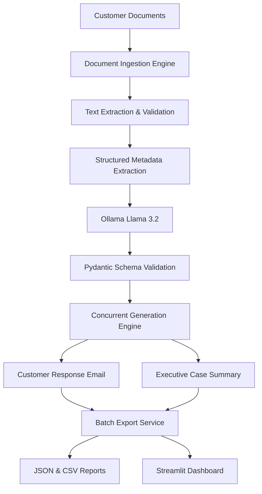

# 🤖 Resolvix-AI-Powered Customer Complaint & Business Workflow Automation System

### Enterprise-Ready GenAI Workflow for Complaint Processing, Case Generation & Executive Reporting

> A privacy-first, batch-oriented AI application that transforms unstructured customer complaint documents into validated structured data, professional customer communications, and executive-ready case summaries using local LLMs.

---

## 🌟 Overview

The **AI-Powered Document Processing & Case Management System** is a production-oriented GenAI application developed as part of the **Final Evaluation Assessment (Project 1: AI-Powered Document Processing & Business Workflow)**.

The system automatically processes customer complaint documents from multiple formats, extracts structured information using a schema-driven workflow, and generates both customer-facing and management-facing outputs.

By leveraging **Ollama + Llama 3.2**, **Pydantic v2**, and **Python AsyncIO**, the application delivers a fully local, secure, and scalable workflow without relying on external APIs or cloud-based AI services.

---

## 🚀 Key Features

### 📂 Multi-Format Document Ingestion

* Supports `.txt`, `.docx`, and `.pdf` files.
* Automatically scans batch directories.
* Detects and logs unsupported file formats.

### 🛡️ Structured Data Extraction

* Extracts and validates 10 critical complaint attributes.
* Uses **Pydantic v2** for strict schema enforcement.
* Ensures deterministic JSON outputs.

### 🤖 AI-Powered Content Generation

* Generates personalized customer response emails.
* Produces professional executive case summaries.
* Grounds outputs strictly in extracted document facts.

### ⚡ Concurrent Processing Engine

* Utilizes `asyncio.gather()`.
* Runs email generation and executive summary creation in parallel.
* Improves throughput and overall efficiency.

### 📊 Interactive Dashboard

* Built using Streamlit.
* Review extracted data and generated content.
* Download processed reports directly from the UI.

### 🔒 Privacy-First Architecture

* Fully local AI inference using Ollama.
* No cloud services or paid APIs required.
* Ensures sensitive customer data never leaves the system.

---

## 🏗️ System Architecture



---

## 🎯 Workflow

### Phase 1 — Document Collection

Customer documents are placed inside the `data/` directory.

### Phase 2 — Text Extraction

The system reads and extracts text from:

* TXT Documents
* Word Documents
* PDF Documents

### Phase 3 — Metadata Extraction

The extracted content is processed by **Llama 3.2** running locally through Ollama.

### Phase 4 — Schema Validation

All extracted fields are validated using **Pydantic v2**.

### Phase 5 — Concurrent Generation

Two AI workflows execute simultaneously:

1. Customer Response Email Generation
2. Executive Case Summary Generation

### Phase 6 — Data Export

Validated records are exported to:

* `output/results.json`
* `output/results.csv`

### Phase 7 — Dashboard Visualization

Users can inspect and download outputs through a Streamlit dashboard.

---

## 📋 Extracted Schema Fields

The application validates and extracts the following attributes:

| Field                    | Type    | Description                        |
| ------------------------ | ------- | ---------------------------------- |
| customer_name            | String  | Customer's full name               |
| email                    | String  | Customer email address             |
| phone_number             | String  | Customer contact number            |
| complaint_category       | String  | Complaint classification           |
| issue_description        | String  | Complaint summary                  |
| resolution_provided      | String  | Resolution details if available    |
| is_complaint             | Boolean | Complaint identification flag      |
| requires_escalation      | Boolean | Escalation requirement             |
| supporting_doc_available | Boolean | Supporting document availability   |
| overall_case_status      | Enum    | Open, Pending, Resolved, Escalated |

---

## 🛠️ Technology Stack

| Layer                | Technology         |
| -------------------- | ------------------ |
| Programming Language | Python 3.10+       |
| Local LLM            | Ollama (Llama 3.2) |
| Validation Framework | Pydantic v2        |
| Document Parsing     | python-docx, pypdf |
| Concurrency Engine   | asyncio            |
| Data Processing      | pandas             |
| Dashboard UI         | Streamlit          |

---

## 📁 Project Structure

```text
ai_document_processor/
│
├── data/
│   ├── complaint_001.txt
│   ├── complaint_002.docx
│   └── test_unsupported.csv
│
├── output/
│   ├── results.json
│   └── results.csv
│
├── src/
│   ├── __init__.py
│   ├── logger.py
│   ├── ingestion.py
│   ├── schema.py
│   ├── extractor.py
│   ├── generators.py
│   └── exporter.py
│
├── app.py
├── main.py
├── requirements.txt
└── README.md
```

---

## ⚙️ Installation

### 1️⃣ Install Ollama

```bash
ollama pull llama3.2
```

### 2️⃣ Clone Repository

```bash
git clone https://github.com/your-username/ai-document-processor.git

cd ai-document-processor
```

### 3️⃣ Create Virtual Environment

```bash
python -m venv venv
```

### 4️⃣ Activate Environment

#### Windows

```powershell
.\venv\Scripts\Activate.ps1
```

#### Linux / macOS

```bash
source venv/bin/activate
```

### 5️⃣ Install Dependencies

```bash
python -m pip install -r requirements.txt
```

---

## ▶️ Running the Application

### Execute Processing Pipeline

```bash
python main.py
```

Outputs generated:

```text
output/results.json
output/results.csv
```

### Launch Streamlit Dashboard

```bash
streamlit run app.py
```

---

## 📊 Generated Outputs

### Structured JSON Record

* Validated customer metadata
* Complaint classification
* Escalation indicators
* Case status information

### Customer Response Email

* Personalized
* Context-aware
* Fact-grounded

### Executive Case Summary

* Five-section management briefing
* Key issue highlights
* Recommended next actions

### Export Reports

* JSON Export
* CSV Export

---

## ✅ Assessment Requirements Coverage

| Requirement                  | Status |
| ---------------------------- | ------ |
| Pure Python Implementation   | ✅      |
| Modular Architecture         | ✅      |
| Local LLM Execution          | ✅      |
| Structured Output Validation | ✅      |
| Workflow Orchestration       | ✅      |
| Async Processing             | ✅      |
| Error Handling & Logging     | ✅      |
| Streamlit Dashboard          | ✅      |
| JSON & CSV Export            | ✅      |
| Production-Oriented Design   | ✅      |

---

## 🔮 Future Enhancements

* Multi-language complaint processing
* Role-based authentication
* Database integration (PostgreSQL / MongoDB)
* REST API deployment
* Docker containerization
* Analytics and reporting dashboards
* Real-time complaint monitoring

---

## 👩‍💻 Author

Developed with ❤️ by Radhika as part of the Final Evaluation Assessment to demonstrate practical implementation of:

* Generative AI Workflows
* Structured Information Extraction
* Local LLM Deployment
* Asynchronous Processing
* Production-Oriented Python Development
